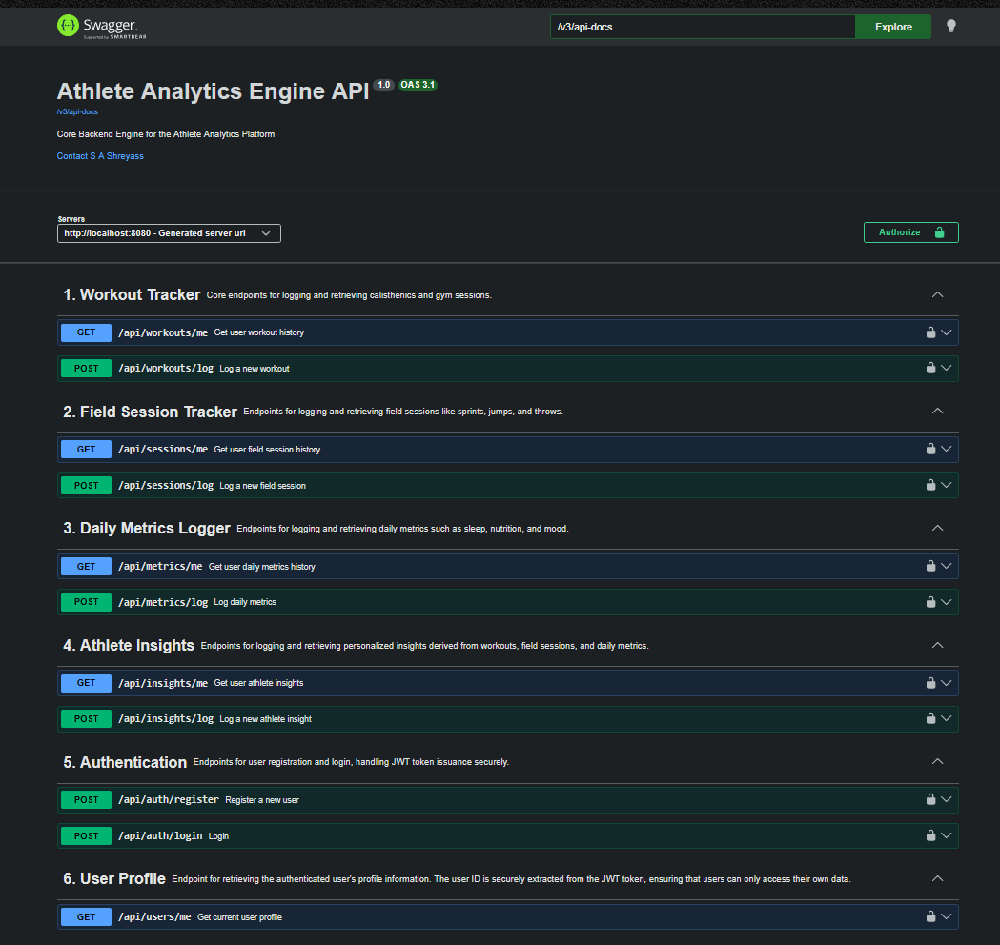
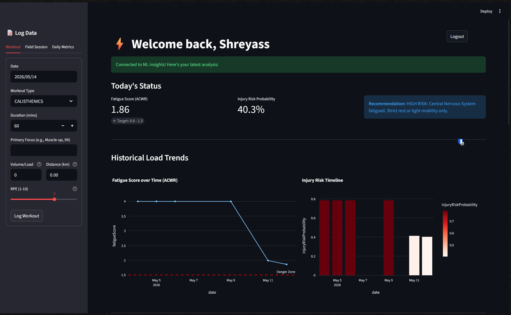
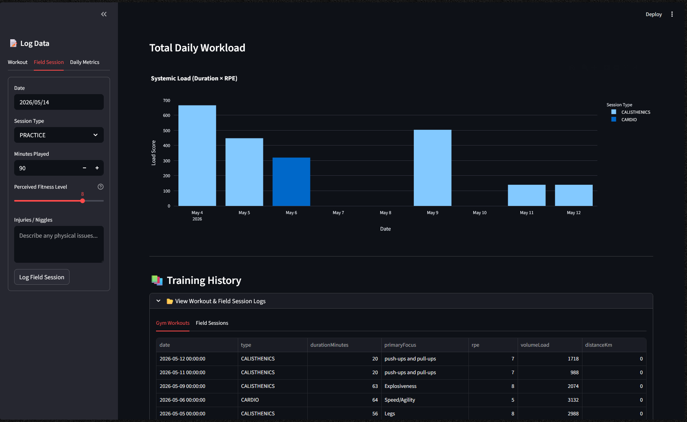
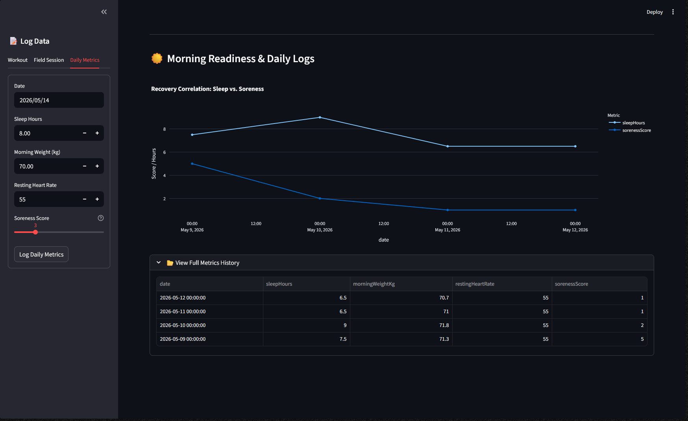

# Athlete Analytics Engine

A distributed, microservice-based platform engineered to track athletic workload, analyze recovery metrics, and predict injury risk using sports science heuristics (ACWR) and machine learning.

Built with a strictly decoupled architecture — data persistence, ML inference, and user presentation are each owned by a dedicated service with no cross-layer bleed.

---

## System Architecture

The platform operates on a three-node architecture:

**1. Core Engine — Java 25 / Spring Boot 4.0.6**
The authoritative source of truth. Owns data persistence, complex relational queries, and secure user management. All REST endpoints are protected by a custom JWT-based authentication filter that enforces strict access control and prevents IDOR vulnerabilities across the entire API surface. The full API is documented via an automated Swagger OpenAPI 3.0 pipeline.

**2. Intelligence Node — Python / FastAPI**
A stateless ML microservice. Ingests raw workload data, calculates the Acute:Chronic Workload Ratio (ACWR), and runs it through a Logistic Regression model to output normalised injury risk probabilities based on workload spikes and intensity thresholds.

**3. Presentation Layer — Python / Streamlit**
A reactive, multi-page web dashboard. Orchestrates HTTP request flows between the Java backend and the Python ML engine and renders real-time data visualisations — systemic load tracking, sleep vs. soreness correlations, and full training history logs.

---

## Tech Stack

| Layer | Technology | Version |
|---|---|---|
| Backend API | Java | 25 |
| | Spring Boot | 4.0.6 |
| | Spring Security + Spring Data JPA | (managed by Spring Boot 4.0.6) |
| | JJWT | 0.11.5 |
| | Lombok | (managed by Spring Boot 4.0.6) |
| API Docs | Springdoc OpenAPI (Swagger UI) | 3.0.3 |
| Database | PostgreSQL | 16 |
| ML Engine | FastAPI | 0.136.1 |
| | scikit-learn | 1.8.0 |
| | Pandas | 3.0.3 |
| | Pydantic | 2.13.4 |
| | Uvicorn | 0.46.0 |
| Dashboard | Streamlit | 1.57.0 |
| | Plotly | 6.7.0 |
| | Requests | 2.34.1 |
| Infrastructure | Docker + Docker Compose | — |

---

## Key Features

- **Secure Authentication** — Full register/login flow with stateless JWT issuance and strict per-endpoint access control.
- **Workload & Readiness Tracking** — Dedicated schemas for gym sessions (calisthenics/strength), field sessions (football/cardio), and daily morning readiness metrics (sleep, weight, resting heart rate).
- **Predictive Analytics** — Implements real-world sports science math (ACWR) to dynamically chart fatigue zones and flag high-risk training days before an injury occurs.
- **Query-Optimised Time-Series Storage** — Composite indexes on `(athlete_id, timestamp)` across all time-series tables (workouts, sessions, metrics) ensure the query planner retrieves chronological data efficiently as the dataset grows, without full table scans.
- **Fully Containerised** — All four services (PostgreSQL, Spring Boot, FastAPI, Streamlit) are orchestrated via Docker Compose with health-checked service dependencies and environment-based credential injection.
- **Interactive Visualisations** — Stacked bar charts for systemic daily load, line charts for recovery correlations, and session history logs.

---

## API Endpoints

| Group | Method | Endpoint | Description |
|---|---|---|---|
| **Authentication** | `POST` | `/api/auth/register` | Register a new user |
| | `POST` | `/api/auth/login` | Login and receive JWT token |
| **User Profile** | `GET` | `/api/users/me` | Get authenticated user's profile |
| **Workout Tracker** | `GET` | `/api/workouts/me` | Get user workout history |
| | `POST` | `/api/workouts/log` | Log a new calisthenics/gym session |
| **Field Session Tracker** | `GET` | `/api/sessions/me` | Get user field session history |
| | `POST` | `/api/sessions/log` | Log a new field session (sprints, jumps, etc.) |
| **Daily Metrics Logger** | `GET` | `/api/metrics/me` | Get daily metrics history |
| | `POST` | `/api/metrics/log` | Log daily readiness metrics (sleep, nutrition, mood) |
| **Athlete Insights** | `GET` | `/api/insights/me` | Get personalised athlete insights |
| | `POST` | `/api/insights/log` | Log a new insight |

> All endpoints except `/api/auth/register` and `/api/auth/login` require a valid JWT Bearer token.

---

## API Documentation

The Core Engine exposes an auto-generated, interactive OpenAPI mapping.

Start the backend and navigate to:
```
http://localhost:8080/swagger-ui/index.html
```



---

## Dashboard

The Streamlit control centre is a multi-page interface providing a centralised view of all athletic metrics.

**Page 1 — Today's Status & Load Trends**
Displays the live ACWR fatigue score, injury risk probability, and an ML-generated recommendation. Historical charts track fatigue score over time with a danger zone threshold line, and a colour-coded injury risk timeline.



**Page 2 — Total Daily Workload & Training History**
Stacked bar chart of systemic load (Duration × RPE) broken down by session type (Calisthenics / Cardio / Practice). Full training history log with workout and field session tabs.



**Page 3 — Morning Readiness & Daily Logs**
Recovery correlation chart tracking sleep hours vs. soreness score over time. Full daily metrics history table (sleep, weight, RHR, soreness).



---

## Local Setup

### Prerequisites
- Docker Desktop

That's it. All services are fully containerised — no local Java, Python, or PostgreSQL installation required.

### 1. Configure environment variables

```bash
cp .env.example .env
```

Open `.env` and fill in your database password and JWT secret.

### 2. Start all services

```bash
docker compose up --build
```

Docker Compose will start all four services in the correct order, with health-checked dependencies ensuring the database is ready before the backend attempts to connect.

| Service | URL |
|---|---|
| Dashboard | http://localhost:8501 |
| Backend API | http://localhost:8080 |
| Swagger UI | http://localhost:8080/swagger-ui/index.html |
| ML Engine | http://localhost:8000 |

To stop:
```bash
docker compose down
```

---

## Roadmap

**Biological Tuning (in progress)**
Currently in a 45-day data accumulation phase. The generic sports science baselines (population-level ACWR thresholds) will be replaced with a custom-trained Logistic Regression model calibrated specifically to the athlete's own biomechanical limits and recovery patterns once the dataset is sufficient.

**Wearable Integration (planned)**
Dedicated ingestion endpoints for raw wearable sensor data (HRV, GPS load).

---

## Portfolio Context

This project is part of a three-project backend portfolio targeting fresher SDE/backend roles:

| Project | Core Engineering Concepts |
|---|---|
| IRCTC Clone | Pessimistic locking, Single Table Inheritance, Spring Security |
| Expense Tracker | JWT auth, IDOR prevention, JPQL aggregations, global exception handling |
| **Athlete Analytics Engine** | **Microservice architecture, ML integration, FastAPI, ACWR, composite indexing, Docker Compose orchestration, personalised modelling** |

---

Designed and engineered by **S A Shreyass**  
CSE Undergraduate, BMSCE Bangalore · [GitHub](https://github.com/shreyass1797)